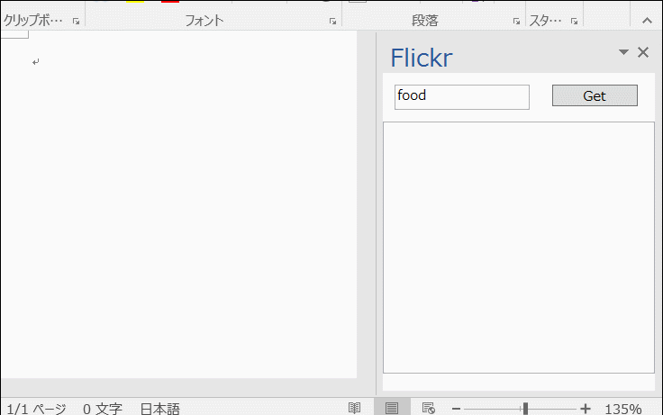

# VSTOSample
VSTO Samples.

[セッション資料はこちら](http://www.slideshare.net/tanakata/20150423-introduction-tovsto)

# ExcelVSTOSignalR

SignalRを使って、Webサイト上のチャットをExcelのシートに転記

# GoogleCalendaySync

Google Calendar API を使って、Google CalendarをOutlookの予定表として一方向同期

# PowerPointVSTOSignalR

SignalRを使って、WebサイトからPowerPointのスライドショーを操作

# VSTOWord

Wordのカスタムペイン領域にFlickrの画像検索と挿入をWPFで実装

# VSTOWordViewInWPF

WPFのコントロールにWordドキュメントを描画。ファイルを選ぶと、Wordを非表示で実行して、XPSとして保存している。